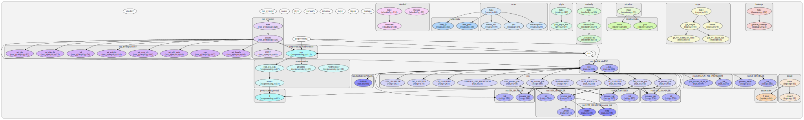

.. pymcpsc documentation master file, created by
   sphinx-quickstart on Wed May 16 11:09:20 2018.
   You can adapt this file completely to your liking, but it should at least
   contain the root `toctree` directive.

Welcome to pymcpsc's documentation!
===================================

.. toctree::
   :maxdepth: 2
   :caption: Contents:
   :numbered:
   :titlesonly:
   :glob:
   :hidden:

   readme_link

Protein Structure Comparison (PSC) is a very important  operation for drug discovery and exploratory biological research. pyMCPSC is a utility that leverages the capabilities of the popular Python programming language while also exploiting the multiple cores of modern CPUs for high performance. It can be easily extended to incorporate new PSC methods, as they are becoming available,  in the consensus scores calculation. pyMCPSC makes it easy for researchers to compare and contrast PSC methods on their data, explore visually  the structural similarities in large datasets, autoclassify query proteins etc. by setting up and performing repeatable experiments. Furthermore, since pyMCPSC is open-sourced, researchers can easily incorporate new PSC methods or add new consensus methods to serve their needs.

As a software architecture, pyMCPSC is organized into several modules called in sequence by the main entry point. The modules are functionally independent and the interface between them is via files. Each module receives a set of parameters, including the files used to read data and write the output results. In a typical scenario, the user sets up an experiment, using command line parameters for supplying information such as the location of protein domain structures data and ground-truth classification (if available). The ground-truth data required by pyMCPSC to perform the analysis steps is the SCOP/CATH classification of the domains in the dataset being analysed. The information is expected to be provided to the utility in a specific format. pyMCPSC first generates pairwise similarity scores for all domain pairs, using the supplied PSC methods and the implemented MCPSC methods, and then generates results to facilitate structure based comparison and analysis. Further details and documentation of the modules with links to the sources can be accessed through the Indices and tables linked below.

   pyMCPSC is organized into several modules, each one implementing a specific functionality. The call graph of methods and modules shows the interaction between the main entry point run_pymcpsc and the other modules with partial functionality. Similarity scores are generated for all protein pairs using the executable binaries of the included PSC methods. Subsequently the scores are scaled, missing data (similarity scores) are imputed and consensus MCPSC scores are calculated for all domain pairs. If the user has supplied ground-truth domain classification information, then comparative analysis results are also generated based on the similarity scores.

Building this documentation
===========================

It is possible to update and build this documentation if you have the full 
sources of pyMCPSC. In order to do so navigate to the docs folder in pyMCPSC
and issue the command::

    make html

Note your system will need to have the *make* toolchain, sphinx and the
sphinx_rtd_theme theme installed.

Indices and tables
==================

* :ref:`genindex`
* :ref:`modindex`
* :ref:`search`
